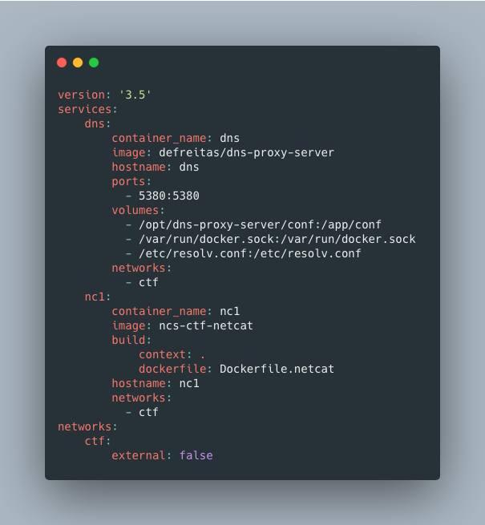

# NCS CTF Docker

This is a repository for the SUNY Poly NCS Club's CTF Challenge Docker container orchestration. We will be using a docker image for creating a DNS Server connected to the same network that all of the challenge containers will be running on. To better be able to start and stop a lot of containers very quickly, we are using `docker-compose`. If you haven't used docker-compose, I highly suggest it for multi-container projects.

## CTF

CTF stands for **Capture the Flag**. Much like the game you play with your friends, there are teams that compete to either find and retrieve the flag or get the flag to their own base. When it comes to the computer version, the creator usually hides a string of letters and/or numbers somewhere for competitors to find. This can be in a number of places from in files to hidden in pictures. Hiding flags within images or even audio is its own category of CTF called `steganography`. The teams usually have a couple of people that specialize in certain areas. There are categories like Web, Forensics, Crypto, and Binary.
**1. Web** - These types of challenges involve finding vulnerabilities within web applications that lead to obtaining a flag.
**2. Forensics** - These types of challenges are more focused around finding something that is hidden on a computer.
**3. Crypto** - These are challenges developed around hidden flags within different types of cryptographic ciphers.
**4. Binary** - These challenges involve exploiting pre-compiled programs or binaries.
**5. Steganography** - These are the challenges where a flag is hidden within another file, usually a picture.

---

## Docker

Docker is an awesome tool that I think everyone should have some knowledge of, even if its not suited for their workflow. The reason we chose to go with Docker is for its ease of creating multiple containers quickly, easily, and repeatably. Also, the use of `images` in the context of Docker is super useful for creating challenges that do not rely on full scale virtual machines or bare metal hardware. In short, a Docker image uses a base image and can be built out without relying on huge distributions and installs. For example the base ubuntu image for Docker is less than 100mb.

### Docker-Compose

`docker-compose` is a command line tool used for orchestrating multiple containers easily. There is a file called `docker-compose.yaml` that contains information about the container you want to create.

This is a pretty simple docker-compose file. As you can see, there are two containers being created, `dns` and `nc1`. These containers each have their own image, hostname, port mappings, and volumes, but share a network.
